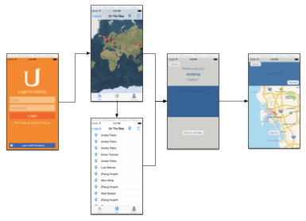
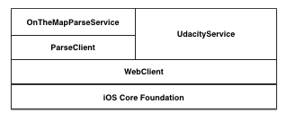
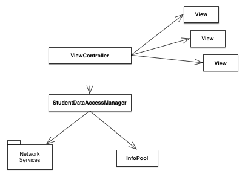
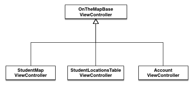
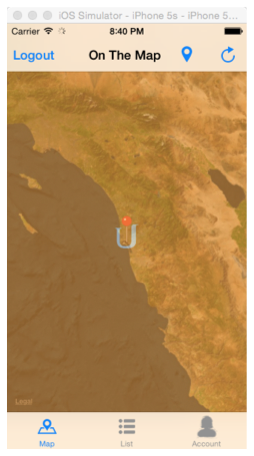
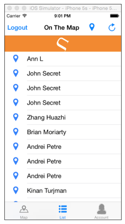

# On The Map

This is our project submission for the Udacity Course *iOS Networking with Swift*, the 3rd course in the *iOS Developer Nanodegree*.

*The project was implemented by just me, Brian Moriarty. This documents speaks in plurals such as “we” and “our” because that tends to make better prose in online documentation.*


## Table of Contents

* [App Overview](#app-overview)
* [Application Core Design](#application-core-design)
  * [OnTheMap Network Services](#onthemap-network-services)
  * [OnTheMap Data Management](#onthemap-data-management)
  * [OnTheMap ViewController Communication](#onthemap-viewcontroller-communication)
* [Login Screen Implementation](#login-screen-implementation)
* [Map Tab Implementation](#map-tab-implementation)
* [Table View Tab Implementation](#table-view-tab-implementation)
* [Account Tab Extra View](#account-tab-extra-view)

## App Overview

The **On The Map** iOS App functional UI design is specified by Udacity. Our implementation sticks very closely to the provided design, with the exception of the added *Account* tab which is an additional tab we chose to add.

This overview will describe the required baseline functionality of the app. The rest of the document will highlight specific areas of our implementation in the context of the baseline design. All screen captures will be from our implementation, and may differ slightly from the mockups provided by Udacity.

The general user workflow for the app is listed in the diagram below. The user is presented with a login screen and may login using either Facebook or a Udacity username password. After login, the user is taking to a map view displaying student study locations geographically. The user may choose to view a listing of the student data in a table view. Finally, the user may create a study location of their own by searching for a place name, and then associating a URL with the place entry.



## Application Core Design

The application is comprised of several custom components designed to provide the core functionality of the app, independent of the UI design.
 
### OnTheMap Network Servies

The diagram below depicts the layered design of our network service components. 

* **iOS Core Foundation:** baseline network capabilities instrinsic to iOS.
* **WebClient:** thin layer of utility functions used to simplify building and executing *HTTP* request calls.
* **UdacityService:** thin layer on top of *WebClient* to simplify requests specific to the Udacity web service.
* **ParseClient:** thin layer for generic *Parse API* requests to arbitrary class types in the Parse web service.
* **OnTheMapParseService:** thin layer specific to the `StudentLocation` class type used to simplify requests to the *Parse API*.



### OnTheMap Data Management

In addition to leveraging the common Model-View-Controller (MVC) design pattern, the *OnTheMap* application also encapsulates all data access using a `StudentDataAccessManager` as the data manager. All logic for authentication, data-management in memory, and data-access over the network is encapsulated by the data manager.



The `InfoPool` component is a generic filtered data pool with limited indexing and sorting capabilities. The `InfoPool` can manage any arbitrary data type provided the type implements the `InfoItem` protocol, show in the code block below.

```swift
// all info items must have at least an ID, Group, and attribute value to sort by
public protocol InfoItem {
    
    // must be unique value among all other info items in the pool
    typealias IdType: Hashable, Comparable
    var id: IdType { get }

    // info items with equal group values are considered part of the same group.
    typealias GroupType: Hashable, Comparable
    var group: GroupType { get }
    
    // the pool is managed as a sorted list and this value is used to sort the info items.
    typealias OrderByType: Comparable
    var orderBy: OrderByType { get }
    
}
``` 

In the *OnTheMap* application, our base `StudentInformation` struct is extended to implement the `InfoItem` protocol, and is added to an array managed by the `StudentDataAccessManager`. The `OrderBy` attribute is implemented as the `UpdatedAt` attributed, meaning our list of data is ordered by the last update time of the data.

The `StudentDataAccessManager` leverages knowledge about the sorted data to make smart requests to the *Parse API* service. Only data updated earlier than the oldest item in the list, or updated later than the most recent item in the list is requested in controlled 100 item batches. This way, when we make a request we are sure to get the most recent data, but we can also continue filling in any older data we may not have requested yet. 

This batched request capability is used at load time, by the **Refresh** button, and leveraged further by the UITableView during scrolling as described later in the document.

### OnTheMap ViewController Communication

Each of the ViewControllers associated with a Tab extend from the `OnTheMapBaseViewController`. This permits them to inherit the core features common to all of them, such as the ToolBar buttons, the `dataManager` property and some of the network activity, extending these as needed for scene specific needs.



The sole data access mechanism for all ViewControllers in the `StudentDataAccessManager`. On Segue, the instance of the `StudentDataAccessManager` is passed on to the next ViewController.

## Login Screen Implementation

In addition to the minimum baseline functionality, the login page supports logging in with Facebook using the ‘FBSDKLoginButton`.

Errors are reported as part of the UI design, rather than using a more intrusive alert popup.


Network activity is communicated to the user with two visual clues.

1. By the standard `UIApplication.sharedApplication().networkActivityIndicatorVisible` spinner on the status bar.
2. By a custom animation which spins the Udacity **U** image on the page.

## Map Tab Implementation

The first scene to load after the Login Screen is the Map Tab. If the user has not entered any location data, the map will appear zoomed out to show as many of the top 100 locations as possible from other students. However, if the student does have previously entered data, the map will zoom to show the last location entered by the user.

While data is loading, the map will display the `UIApplication.sharedApplication().networkActivityIndicatorVisible` as well as a custom translucent orange view with a spinning **U** image, as displayed below.



To ensure the user’s own data is always downloaded to the map, even if it is older than the most recent 100 locations, a separate request is made  to the `StudentLocation` *Parse API* service to get just data owned by the user.

## Table View Tab Implementation

The table view receives an already populated `dataManager` when it is segued to so does not initially need to fetch data.

There are three ways to cause the table view tab to fetch additional data, beyond the initial 100 downloaded items.

1. Tap the *Refresh* button to get the next 100 or any updates since the previous fetch.
2. Pull down to scroll when the first row is showing, this will show a spinning Udacity **U** animation on an orange background at the top of the scroll view, shown in the  image below.
3. Continue scrolling down to the end of the list, and at about 20 items from the end of the list a request for the next 100 items will be made.




## Account Tab Extra View

pending

